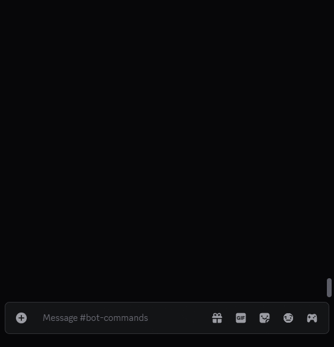

<div align="center">
  <br>
  
</div>

About
-----
Fae is a web-scraping Discord bot for the MMO Black Desert. In particular, the bot adds the slash commands `/adv` and `/gld` which scrape the [Adventurer](https://www.naeu.playblackdesert.com/en-US/Adventure/Home) and [Guild](https://www.naeu.playblackdesert.com/en-US/Adventure/Guild) lookup pages and present the relevant information in response to the parameters of the command you send. It is more or less like manually navigating these pages to retrieve information about a player or guild, except that the bot will take a chunk of that cognitive load and does the work for you.

The game regions currently supported are:
  * Asia (TH/SEA).
  * Europe (EU).
  * North America (NA).

Configuring the Bot
-------------------
### Set Up *.env*
You must create a `.env` file in the same directory as `config.json`, which will contain your bot's **application ID** and **authentication token**. You can get both the application ID and the token from your application's page on the [Discord Developer Portal](https://discord.com/developers/applications/).
  * You can find your **application ID** on the **OAuth2** page, under *Client ID*.
  * You can find your **authentication token** on the **Bot** page, under *Token*. You may have to press the *Reset Token* button if you do not see it. Save the token securely, or you will have to generate a new one if you lose it.

> [!WARNING]
> The authentication token is essentially your bot's login password. Never expose it publicly or share it with anyone. If compromised, generate a new one, then update your .env file and restart the bot.

After you create this file, add `APPLICATION_ID = ` and `AUTH_TOKEN = `, each on a separate line then assign their respective values as described above. See below for an example file.

#### Example *.env*
```dotenv
APPLICATION_ID = 1698347206038479996
AUTH_TOKEN = aW0gbm90IGEgcmVhbCB0b2tlbg.MTMzNw.cGxlYXNlIA-ZG8gbm90IGJlIGV2aWw-dGhhbng
```

### Configure *config.json*
The bot needs to be configured before it could run properly. Its configuration is stored in [config.json](config.json), which you must update with your own Discord application information. The configuration file contains the following keys:

| Key                 | Type    | Description                                                                                                                                                                                                                                                                                                                                                                                                                                                                                                                                                                                  |
|---------------------|:-------:|----------------------------------------------------------------------------------------------------------------------------------------------------------------------------------------------------------------------------------------------------------------------------------------------------------------------------------------------------------------------------------------------------------------------------------------------------------------------------------------------------------------------------------------------------------------------------------------------|
| `owners`            | Array   | An array of user IDs. Your application can have more than one owner. In such case, separate each user ID with a comma.<br>*See: [Where can I find my User/Server/Message ID?](https://support.discord.com/hc/en-us/articles/206346498-Where-can-I-find-my-User-Server-Message-ID-)*                                                                                                                                                                                                                                                                                                          |
| `guilds`            | Array   | An array of server IDs. Your application can deploy slash commands to more than one guild. In such case, separate each server ID with a comma.<br>*See: [Where can I find my User/Server/Message ID?](https://support.discord.com/hc/en-us/articles/206346498-Where-can-I-find-my-User-Server-Message-ID-)*<br><br>When `global_sync` is set to `false` (default), the bot's slash commands will only be visible on the server whose ID is specified. It is recommended that you create a server to test the commands on before enabling global sync, as guild-only commands sync instantly. |
| `global_sync`       | Boolean | Decides whether commands are available globally (i.e., on all servers) or are confined to the server whose ID is specified in `guilds`. When developing or testing, the value of this key should always be `false`.                                                                                                                                                                                                                                                                                                                                                                          |
| `logging.enabled`   | Boolean | Decides whether a message logger should be set up. If set to `true`, a log file will be created in `/logs/` when the application is run.                                                                                                                                                                                                                                                                                                                                                                                                                                                     |
| `logging.overwrite` | Boolean | Decides whether the logger should create a log file with or without a timestamp in the name. If set to `true`, the log file will be overwritten each time the application is run.                                                                                                                                                                                                                                                                                                                                                                                                            |
| `logging.level`     | String  | Specifies the type of messages to log. The value is case-insensitive and must be one of: `debug`, `info`, `warning`, `error`, or `critical`.                                                                                                                                                                                                                                                                                                                                                                                                                                                 |

### Configure Bot Installation
In addition to the local configuration described above, you also need to configure how your application (i.e., bot) is installed in Discord. This is done from the application's page on the [Discord Developer Portal](https://discord.com/developers/applications).

From the application's page,
1. Select the **Installation** page from the sidebar on the left.
2. Under **Installation Contexts**, make sure *Guild Install* is checked. If *User Install* is also checked, uncheck it.
3. Under **Default Install Settings**, make sure the `applications.commands` scope is added.
4. Press the *Save Changes* button.

The URL present under *Install Link* is what you will use to install the bot to your server.

> [!NOTE]  
> Discord allows bots that use slash commands (as is the case with Fae) to be installed to a server without having to invite the bot as member of the server. However, if you still wish to have the bot physically present in your server, then in Step 3 above, also add the `bot` scope and only give it the `Connect` permission.

Running the Bot
---------------
### Prerequisites
The following prerequisites are required to run the code:
* Python **3.11.0** or greater with the `python3-venv` module installed.
* Python's package manager `pip`.

### Setup
Once the prerequisites above are met, simply `cd` into the bot's directory then execute `.\setup.ps1` from a PowerShell terminal if you are on a Windows system, or execute `source setup.sh` from a Bash terminal if you are on a Linux system. The script will then set up a virtual environment and install the required pip packages.

### Launch
After the setup is complete, execute `./run.ps1` from a PowerShell terminal or `./run.sh` from a Bash terminal. When the bot goes online and is ready for use, you should be able to see the following in your terminal:
```
Logged in as Fae#0000.
Bot is ready.
```

Demo
----
> [!NOTE]
> If the `region` argument is not specified, the bot assumes North America (NA).

<details>
  <summary><code>/adv</code></summary>
    <p align="center">
      
    </p>
</details>

<details>
  <summary><code>/gld</code></summary>
    <p align="center">
      
    </p>
</details>

Legal
-----
This project is distributed under the terms of the [MIT License](LICENSE).
